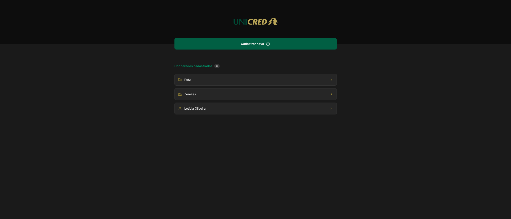

<div align="center" id="top"> 
  <a href="https://unicred-challenge.vercel.app/">Demo</a>
</div>

<h1 align="center">Unicred Challenge</h1>

<p align="center">
  

  

  
</p>

<hr>

<p align="center">
  <a href="#dart-about">About</a> &#xa0; | &#xa0; 
  <a href="#sparkles-features">Features</a> &#xa0; | &#xa0;
  <a href="#rocket-technologies">Technologies</a> &#xa0; | &#xa0;
  <a href="#white_check_mark-requirements">Requirements</a> &#xa0; | &#xa0;
  <a href="#checkered_flag-starting">Starting</a> &#xa0; | &#xa0;
  <a href="https://github.com/oliveiralecca" target="_blank">Author</a>
</p>

<br>



## :dart: About ##

The goal of this project was to do a CRUD just in the front-end application layer. To do this some technologies were used like React Context API to centralize the data management and the browser Local Storage to persist them. Other techs were used for the project style and structure like Styled Components and TypeScript. The React Hook Form library was used to facilitate the form construction and manipulation and the ESLint was used to maintain the pattern of code coherent. 

## :sparkles: Features ##

:heavy_check_mark: List of registered members;\
:heavy_check_mark: Each member detail page;\
:heavy_check_mark: The possibility of changing some member data;\
:heavy_check_mark: The possibility of removing a member;\
:heavy_check_mark: Form to register a new member;\
:heavy_check_mark: Two kinds of members to register;\
:heavy_check_mark: Check if the member is already on the list;\
:heavy_check_mark: It only lets register a new member if the required data were filled

## :rocket: Technologies ##

The following tools were used in this project:

- [Vite](https://vitejs.dev/)
- [React](https://pt-br.reactjs.org/)
- [TypeScript](https://www.typescriptlang.org/)
- [Styled Components](https://styled-components.com/)
- [React Hook Form](https://react-hook-form.com/)
- [React Router](https://reactrouter.com/en/main)
- [Zod](https://zod.dev/)

## :white_check_mark: Requirements ##

Before starting :checkered_flag:, you need to have [Git](https://git-scm.com) and [Node](https://nodejs.org/en/) installed.

## :checkered_flag: Starting ##

```bash
# Clone this project
$ git clone https://github.com/oliveiralecca/unicred-challenge

# Access
$ cd unicred-challenge

# Install dependencies
$ yarn or npm i

# Run the project
$ yarn dev or npm run dev

# The project will initialize in the <http://localhost:5173>
```

&#xa0;

Made with 💕 by <a href="https://github.com/oliveiralecca" target="_blank">Letícia Oliveira</a>

&#xa0;

<a href="#top">Back to top 🔝</a>
